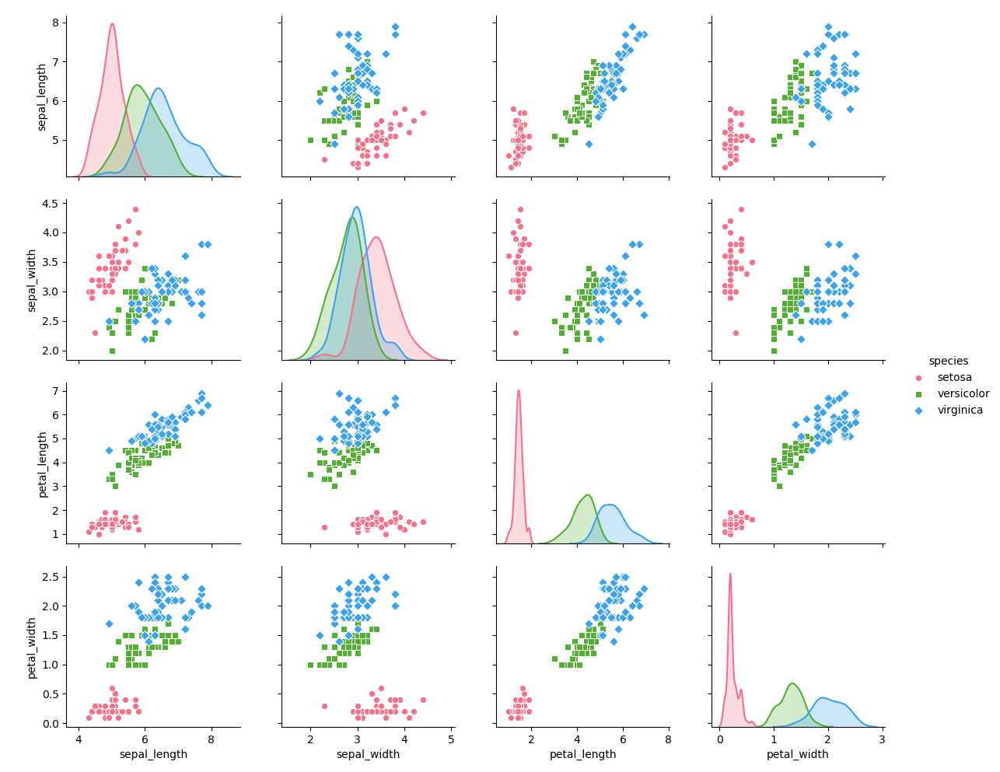
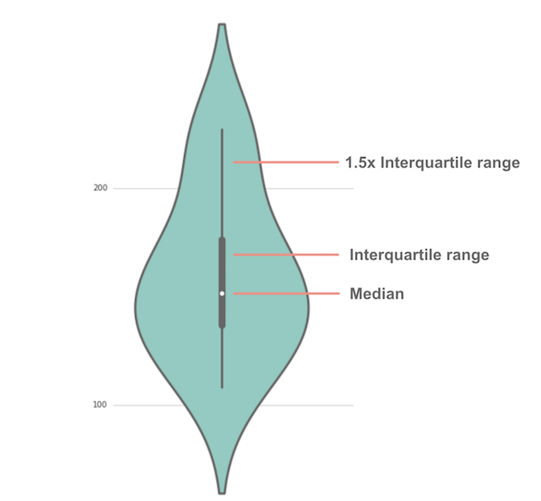
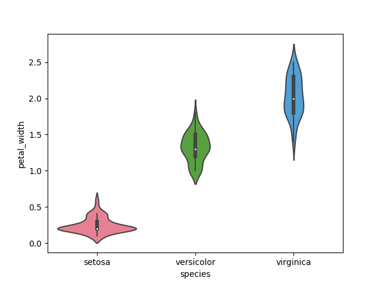
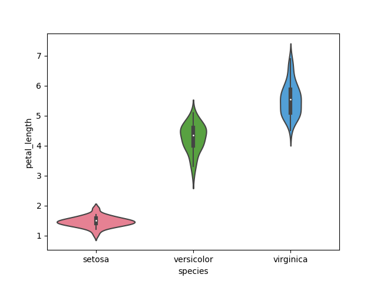
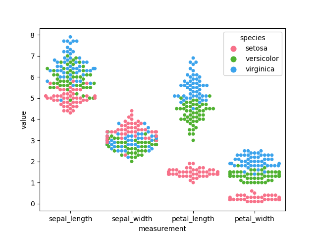

# Programming and Scripting Project - Fisher’s Iris data set

This repository contains the project about Fisher's Iris data set. It includes documentation and code in Python based on researches. 

[See here for the instructions](https://github.com/ianmcloughlin/project-pands/raw/master/project.pdf)

## The main goal and the key points

* Research background information about the data set and write a summary about it.
* Keep a list of references you used in completing the project.
* Download the data set and write some Python code to investigate it.
* Summarise the data set by, for example, calculating the maximum, minimum and mean of each column of the data set. Create Python script
* Write a summary of your investigations.
* Include supporting tables and graphics as you deem necessary.

## Background information and summary about the data set

Iris data set is a multivariate data set introduced by the British statistician and biologist Ronald Fisher in his 1936 paper.The use of multiple measurements in taxonomic problems as an example of linear discriminant analysis. It is sometimes called Anderson's Iris data set because Edgar Anderson collected the data to quantify the morphologic variation of Iris flowers of three related species. The data set consists of 50 samples from each of three species of Iris:

||||
|-----------|-----------|-----------|
| <p align="center"> **Iris Versicolor** </p> | <p align="center"> **Iris Setosa** </p> | <p align="center"> **Iris Virginica** </p> |

Four features were measured from each sample:
* Sepal length(cm)
* Sepal Width(cm)
* Petal Length(cm)
* Petal Width(cm)


Based on the combination of the above four features, Fisher developed a linear discriminant model to distinguish the species from each other. 
Interesting and challenging in the relation of Iris flowers is the fact that sepal and petal look quite similar contrary to other flowers where sepal is usually green and easy to distinguish from the petal.


## Data set review

The data set used for this project was downloaded from the UCI Machine Learning Repository. This repository contains iris dataset widely used in many publications and research projects across the world. The Iris flower data set is a classic, well-known data set example for data mining and data exploration and is traditionally used for classification and prediction

* Number of Instances: 150 (50 in each of three classes)

* Number of Attributes: 4 numeric, predictive attributes and the class


Attribute Information:
1. sepal length in cm
1. sepal width in cm
1. petal length in cm
1. petal width in cm
1. class:
    
    * Iris Setosa
    * Iris Versicolour
    * Iris Virginica
    
Based on the combination of these four features, Fisher developed a linear discriminant model to distinguish the species from each other. This data set became a typical test case for many statistical classification techniques in machine learning.

## Investigating data set using Python script

### Evaluating data sets

The data set contains raw data with comma-separated values. To make those data more meaningful and readable for a regular user the Python script [segregation.py][1] has been created. The pandas was used to load and read file "iris.data" from local folder "Dataset". The names of each column were specified when loading the data. Having data loaded in to pandas it was easy to obtain the required information.

Using ***print(dataset.shape)*** it displays the number of instances and attributes: **(150, 5)**.

To visualize first ten rows data with appropriate column names ***print(dataset.head(10))*** was used.<br />
This displayed segregated data in the [terminal](Outputs/dataoutputs.png) as in the table below.

| No.| sepal-length | sepal-width | petal-length | petal-width | class |
|---|-----|-----|-----|-----|-------------|
| 0 | 5.1 | 3.5 | 1.4 | 0.2 | Iris-setosa |
| 1 | 4.9 | 3.0 | 1.4 | 0.2 | Iris-setosa |
| 2 | 4.7 | 3.2 | 1.3 | 0.2 | Iris-setosa |
| 3 | 4.6 | 3.1 | 1.5 | 0.2 | Iris-setosa |
| 4 | 5.0 | 3.6 | 1.4 | 0.2 | Iris-setosa |
| 5 | 5.4 | 3.9 | 1.7 | 0.4 | Iris-setosa |
| 6 | 4.6 | 3.4 | 1.4 | 0.3 | Iris-setosa |
| 7 | 5.0 | 3.4 | 1.5 | 0.2 | Iris-setosa |
| 8 | 4.4 | 2.9 | 1.4 | 0.2 | Iris-setosa |
| 9 | 4.9 | 3.1 | 1.5 | 0.1 | Iris-setosa |

Finally using ***print(dataset.describe())***, it was possible to do some statistical summary on data set.

| | sepal-length | sepal-width | petal-length | petal-width |
|---|-----|-----|-----|-----|
| **count** | 150.000000 | 150.000000 | 150.000000 | 150.000000 |
| **mean** | 5.843333 | 3.054000 | 3.758667 | 1.198667 |
| **std** | 0.828066 | 0.433594 | 1.764420 | 0.763161 |
| **min** | 4.300000 | 2.000000 | 1.000000 | 0.100000 |
| **25%** | 5.100000 | 2.800000 | 1.600000 | 0.300000 |
| **50%** | 5.800000 | 3.000000 | 4.350000 | 1.300000 |
| **75%** | 6.400000 | 3.300000 | 5.100000 | 1.800000 |
| **max** | 7.900000 | 4.400000 | 6.900000 | 2.500000 |

Looking at the above table, it is clear that all values have the same scale and ranges between 0 and 8 centimetres.
It means all data in data set do not require normalization to produce valuable results.

### Visualization of results

Having numeric variables in the data set allows creating easily multiple visual presentations of data.

The simple box and whisker plots of each variable present a clear idea of the distribution of the input attributes.


Using just one line of code ***dataset.hist()*** histogram of each input can be created.


The histogram demonstrates that two of the input variables have a [Gaussian distribution][2]. 

It is also extremely easy in Python (***scatter_matrix(dataset)***) to generate scatter matrix plot for each variable of iris data set.


Using Wikipedia [scatter][3] examples as references look like most of the scatter plots produced acceptable separations on the plots. The best separation of data that allows determining species is based on petal-width and petal-length and the worst is represented by sepal-length and sepal-width.

## Different analysis and approaches to the data set

In this paragraph, other ways and methods will be presented to analyse data.  One of the very useful library for Python is the **Seaborn**. Seaborn is a Python data visualization library based on **matplotlib**. It gives the user access to drawing sophisticated statistical plots.The [adv-segregation.py][6] was created to demonstrate the advantage of use of seaborn vs. regular grapic functions.
The first advantage of using seaborn is that comes with a [built-in datasets][7] which already include Iris data.
The Iris dataset can be simply loaded using seaborn.

```python
dataset = sns.load_dataset("iris")
```
Now is possible to do the same work as before but using more advanced tools.

### Pairplot

This graph is a better version of the scatter matrix and allows the user with easier data presentation. It shows a relationship between different data across multiple dimensions. To generate this graph, below function**sns.pairplot()** was used. There are multiple options to manipulate outcome on the plot i.e. **palette** to change colours of data or **markers** to indicate different groups of data.

```python
sns.pairplot(dataset, hue="species", palette="husl", markers=["o", "s", "D"])
```



### Violin Plot - Categorical Distribution Plot

Violin plots allow to visualize the distribution of a numeric variable for one or several groups. It is really close from a boxplot, but allows a deeper understanding of the density. Violins are particularly adapted when the amount of data is huge and showing individual observations gets impossible. This graph is one of the best and convenient way of data presentation. It shows the distribution of quantitative data across several levels of one (or more) categorical variables such that those distributions can be compared. The black bar in the centre of each figure is related to the interquartile range.



```python
sns.violinplot(x="species", y="petal_width", palette="husl", data=dataset)
```


```python
sns.violinplot(x="species", y="petal_length", palette="husl", data=dataset)
```


Changing data for "y" axis shows a correlation between species for different parameters. More violin graphs can be found in [Outputs][8] folder. 

### Swarmplot - Categorical Scatterplot

A swarm plot is a good complement to violin plot in cases where all observations along with some representation of the underlying distribution can be shown. This graph belong to **Categorical Scatterplots** which means that one of main variables is divided into discrete groups. Dataset was transformed using **pandas.melt** function before displayed on "swarmplot".

```python
dataset_melt = pd.melt(dataset, "species", var_name="measurement")
sns.swarmplot(x="measurement", y="value", hue="species",palette="husl", data=dataset_melt)
plt.show()
```



## Going beyond the project and using more advanced Python tools

Moving to another aspect of using Iris data set is machine learning that can be performed. The **Scikit-learn** software machine learning library for the Python was incorporated for this task. This library has a number of useful features like various classification, regression and clustering algorithms including support vector machines. Scikit has also built-in Iris data set that can be loaded straight in to the python program but for this project existing data set ***dataset*** from seaborn in **adv-segregation.py** was used.<\br> 
The following steps was carried out:

* Investigation on the data set
* Select the best prediction model
* Predict the answer

Based on the researches on the Machine Learning content available online became clear that for first steps in this topic the best and the easiest to implement prediction model that can be used for this project is the KNN algorithm. The KNN algorithm is very simple and an accurate model with slightly worst accuracy than Support Vector Machines (SVM) but still good enough for this test.
Dataset was split into two groups where one group was used as a validation dataset. 
Using KNN algorithm directly on the validation dataset, below results were produced (accuracy score, confusion matrix, classification report). 

```python
0.9
[[ 7  0  0]
 [ 0 11  1]
 [ 0  2  9]]
              precision    recall  f1-score   support

      setosa       1.00      1.00      1.00         7
  versicolor       0.85      0.92      0.88        12
   virginica       0.90      0.82      0.86        11

   micro avg       0.90      0.90      0.90        30
   macro avg       0.92      0.91      0.91        30
weighted avg       0.90      0.90      0.90        30
```

The results reveal that the accuracy of this prediction model is 0.9 (90%). Precision, recall, f1-score and support also showing satisfying feedback for each class.
In the end, this model was tested on the user entered data. Data for three different species were used.

| sepal-length | sepal-width | petal-length | petal-width | class |
|-----|-----|-----|-----|-------------|
| 5.1 | 3.5 | 1.4 | 0.2 | Iris-setosa |
| **4.9** | **3.0** | **1.4** | **0.2** | **Iris-setosa** |
| 4.7 | 3.2 | 1.3 | 0.2 | Iris-setosa |
| 7.0 | 3.2 | 4.7 | 1.4 | Iris-versicolor |
| **6.4** | **3.2** | **4.5** | **1.5** | **Iris-versicolor** |
| 6.9 | 3.1 | 4.9 | 1.5 | Iris-versicolor |
| 6.8 | 3.0 | 5.5 | 2.1 | Iris-virginica |
| **5.7** | **2.5** | **5.0** | **2.0** | **Iris-virginica** |
| 5.8 | 2.8 | 5.1 | 2.4 | Iris-virginica |


```python
Please enter a sepal length in cm: 4.9
Please enter a sepal width in cm: 3.0
Please enter a petal length in cm: 1.4
Please enter a petal width in cm: 0.2


The tested species is:  ['setosa']
```

```python
Please enter a sepal length in cm: 6.4
Please enter a sepal width in cm: 3.2
Please enter a petal length in cm: 4.5
Please enter a petal width in cm: 1.5


The tested species is:  ['versicolor']
```

```python
Please enter a sepal length in cm: 5.7
Please enter a sepal width in cm: 2.5
Please enter a petal length in cm: 5.0
Please enter a petal width in cm: 2.0


The tested species is:  ['virginica']
```
The answers produced by the prediction model were perfectly accurate in all three tests.  

## Brief Python project program description

The Phyton program [segregation.py][1] was created to allow user basic interaction with the Iris data set. The program was updated a few times and evolved during this project creation. There are many approaches to load and read Iris data set in Python however in this basic program the solution that reflect final Project requirement was used. The Iris data set **iris.data** was downloaded from the UCI repository and it was not modified to a different format (csv and columns name) to show that Python can handle that kind of raw file. Mainly libraries like pandas and matplotlib were used to work on the data set.

To run this program the Python environment is required on the PC. Following steps help to setup software for the first run

* Install Python on your PC. You can use [Anaconda Distribution](https://www.anaconda.com/distribution/).  
* Use Command Prompt (you can use any console i.e. [Cmder](https://cmder.net/)) and navigate to the folder where you downloaded this repository programs.
* Type python "program name that you want to run" i.e. python segregation.py.

The program is loading data set in the background at the start from the folder Dataset and then welcome screen with "Menu" is displayed.

```python
Welcome to Programing and Scripting Project Program about the Iris Data Set.
This program contains the Iris data set which was automatically loaded into the program.
You can choose from the following menu option to display basic information and plot different graphs.

------------------------------ MENU ------------------------------
1. Display information about row and columns in data set
2. Display first 10 rows of segregated data
3. Display the statistical summary
4. Display box and whiskers plots
5. Display histogram of each input variable
6. Display scatter matrix plot
7. Exit
------------------------------------------------------------------
Enter your selection [1-7]:
```
In this section of code the ***def*** statement together with ***while*** loop and ***if*** condition was used to create **menu()** function. 

The first three menu options provide basic and statistical information about the data set and involve pandas libraries to carried out this task.

* ***print(dataset.shape)*** return dimensions and size of data frame. In this case number of rows and columns.
* ***print(dataset.head(10))*** display first ten rows of data set.
* ***print(dataset.describe())*** shows basic statistical details of data frame.

Next three positions of the menu (4-6) were clearly described in the [Visualization of results](#visualization-of-results) paragraph. 

The terminal window is going to be cleared after any selection from the menu regardless of the operating system. This involve **os** library.

```python
if os.name =="nt":
    cl = "cls"
else:
    cl = "clear"

os.system(cl)
```

Program is running continuously allows the user to make more choices from the menu until option seven is selected. This will terminate the program and display a goodbye message.

```python
Thank you for using this program :)
Goodbye!
```
 
## Conclution and summary

Working on this project became clear that Python together with other libraries in Anaconda environment is a very powerful tool for any data manipulation. This very high-level of programing language is now the foundation for scientists who work with a large number of data sets. This project confirmed how easy and efficient is Python. Even for the user without any programming skills getting into the simple data presentation and produce meaningful results can be achieved in short timeframe. Looking at other languages like i.e. ".Net C#" creating the same graphs and calculation would take much more time and skills than Python.

Going forward to use Python for Machine Learning process is absolutely phenomenal tools like [scikit-learn][4] and [seaborn][5] available that in an easy way provide access to many predictive algorithms and a high-level interface for drawing statistical graphics. 

## References

1. [Wikipedia - Iris flower data set](https://en.wikipedia.org/wiki/Iris_flower_data_set)
1. [Iris Versicolor](https://www.lakeforest.edu/academics/programs/environmental/courses/es204/iris_versicolor.php)
1. [Iris Setosa](https://calphotos.berkeley.edu/cgi/img_query?enlarge=0000+0000+1202+1326)
1. [Iris Virginica](https://www.fs.fed.us/wildflowers/beauty/iris/Blue_Flag/images/iris_virginica_virginica_lg.jpg)
1. [Iris Data Set](http://mirlab.org/jang/books/dcpr/dataSetIris.asp?title=2-2%20Iris%20Dataset)
1. [UCI Machine Learning Repository - data set for this project](https://archive.ics.uci.edu/ml/datasets/iris)
1. [Wikipedia - Normal distribution](https://en.wikipedia.org/wiki/Normal_distribution)
1. [Watson Analytics Use Case: The Iris Data Set](https://www.ibm.com/communities/analytics/watson-analytics-blog/watson-analytics-use-case-the-iris-data-set/)
1. [Wikipedia - Scatter plot of Iris Data Set](https://en.wikipedia.org/wiki/Iris_flower_data_set#/media/File:Iris_dataset_scatterplot.svg)
1. [Pynative - Python function](https://pynative.com/python-check-user-input-is-number-or-string/)
1. [Seaborn](https://seaborn.pydata.org/)
1. [Scikit-Learn](https://scikit-learn.org/stable/supervised_learning.html#supervised-learning)
1. [Seaborn datasets](https://github.com/mwaskom/seaborn-data)
1. [Machine Learning](https://machinelearningmastery.com/machine-learning-in-python-step-by-step/)
1. [Machine Learning on Iris](https://diwashrestha.com/2017/09/18/machine-learning-on-iris/)

[1]: segregation.py 
[2]: https://en.wikipedia.org/wiki/Normal_distribution
[3]: https://en.wikipedia.org/wiki/Iris_flower_data_set#/media/File:Iris_dataset_scatterplot.svg
[4]: https://scikit-learn.org/stable/supervised_learning.html#supervised-learning
[5]: https://seaborn.pydata.org/
[6]: adv-segregation.py
[7]: https://github.com/mwaskom/seaborn-data
[8]: Outputs/