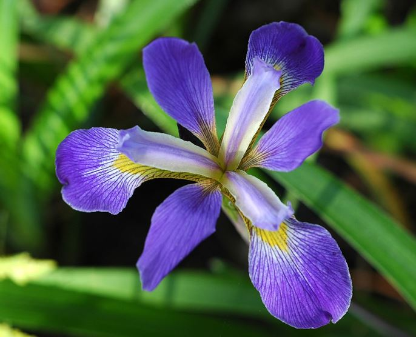
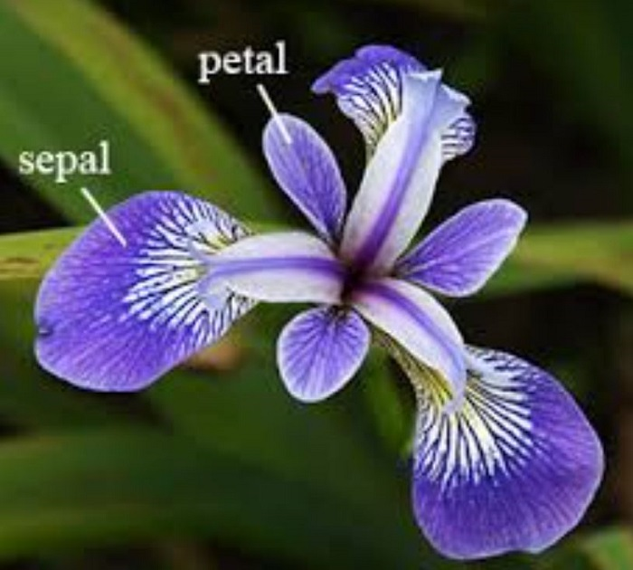
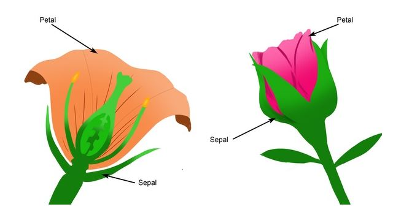
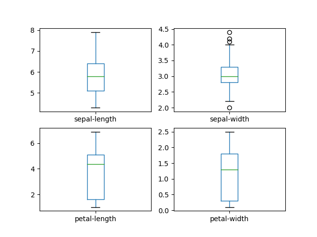
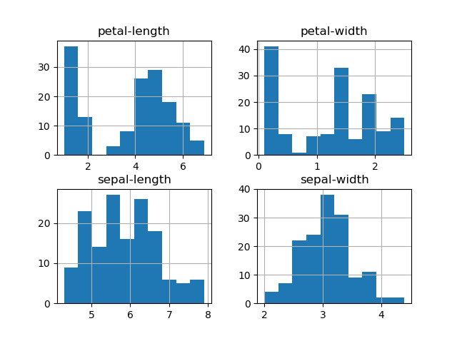
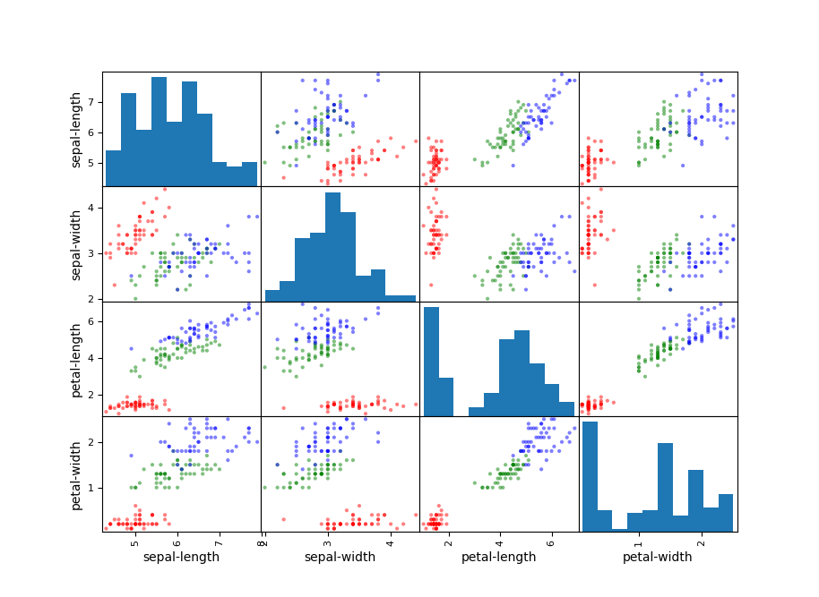

# Programming and Scripting Project - Fisher’s Iris data set

This repository contains the project about Fisher's Iris data set. It includes documentation and code in Python based on researches. 

[See here for the instructions](https://github.com/ianmcloughlin/project-pands/raw/master/project.pdf)

## The main goal and the key points

* Research background information about the data set and write a summary about it.
* Keep a list of references you used in completing the project.
* Download the data set and write some Python code to investigate it.
* Summarise the data set by, for example, calculating the maximum, minimum and mean of each column of the data set. Create Python script
* Write a summary of your investigations.
* Include supporting tables and graphics as you deem necessary.

## Background information and summary about the data set

Iris data set is a multivariate data set introduced by the British statistician and biologist Ronald Fisher in his 1936 paper.The use of multiple measurements in taxonomic problems as an example of linear discriminant analysis. It is sometimes called Anderson's Iris data set because Edgar Anderson collected the data to quantify the morphologic variation of Iris flowers of three related species. The data set consists of 50 samples from each of three species of Iris:

||||
|-----------|-----------|-----------|
| 
 **Iris Versicolor** 
 | 
 **Iris Setosa** 
 | 
 **Iris Virginica** 
 |

Four features were measured from each sample:
* Sepal length(cm)
* Sepal Width(cm)
* Petal Length(cm)
* Petal Width(cm)

Based on the combination of the above four features, Fisher developed a linear discriminant model to distinguish the species from each other. 
Interesting and challenging in the relation of Iris flowers is the fact that sepal and petal look quite similar contrary to other flowers where sepal is usually green and easy to distinguish from the petal.

## Data set review

The data set used for this project was downloaded from the UCI Machine Learning Repository. This repository contains iris dataset widely used in many publications and research projects across the world.

* Number of Instances: 150 (50 in each of three classes)

* Number of Attributes: 4 numeric, predictive attributes and the class

Attribute Information:
1. sepal length in cm
1. sepal width in cm
1. petal length in cm
1. petal width in cm
1. class:
    
    * Iris Setosa
    * Iris Versicolour
    * Iris Virginica
    
Based on the combination of these four features, Fisher developed a linear discriminant model to distinguish the species from each other. This data set became a typical test case for many statistical classification techniques in machine learning.

## Investigating dataset using Python script

### Evaluating datasets

The dataset contains raw data with comma-separated values. To make those data more meaningful and readable for a regular user the Python script [segregation.py][1] has been created. The pandas was used to load and read file "iris.data" from local folder "Dataset". The names of each column were specified when loading the data. Having data loaded in to pandas it was easy to obtain the required information.

Using ***print(dataset.shape)*** it displays the number of instances and attributes: **(150, 5)**.

To visualize first ten rows data with appropriate column names ***print(dataset.head(10))*** was used. 

| No.| sepal-length | sepal-width | petal-length | petal-width | class |
|---|-----|-----|-----|-----|-------------|
| 0 | 5.1 | 3.5 | 1.4 | 0.2 | Iris-setosa |
| 1 | 4.9 | 3.0 | 1.4 | 0.2 | Iris-setosa |
| 2 | 4.7 | 3.2 | 1.3 | 0.2 | Iris-setosa |
| 3 | 4.6 | 3.1 | 1.5 | 0.2 | Iris-setosa |
| 4 | 5.0 | 3.6 | 1.4 | 0.2 | Iris-setosa |
| 5 | 5.4 | 3.9 | 1.7 | 0.4 | Iris-setosa |
| 6 | 4.6 | 3.4 | 1.4 | 0.3 | Iris-setosa |
| 7 | 5.0 | 3.4 | 1.5 | 0.2 | Iris-setosa |
| 8 | 4.4 | 2.9 | 1.4 | 0.2 | Iris-setosa |
| 9 | 4.9 | 3.1 | 1.5 | 0.1 | Iris-setosa |

Finally using ***print(dataset.describe())***, it was possible to do some statistical summary on dataset.

| | sepal-length | sepal-width | petal-length | petal-width |
|---|-----|-----|-----|-----|
| **count** | 150.000000 | 150.000000 | 150.000000 | 150.000000 |
| **mean** | 5.843333 | 3.054000 | 3.758667 | 1.198667 |
| **std** | 0.828066 | 0.433594 | 1.764420 | 0.763161 |
| **min** | 4.300000 | 2.000000 | 1.000000 | 0.100000 |
| **25%** | 5.100000 | 2.800000 | 1.600000 | 0.300000 |
| **50%** | 5.800000 | 3.000000 | 4.350000 | 1.300000 |
| **75%** | 6.400000 | 3.300000 | 5.100000 | 1.800000 |
| **max** | 7.900000 | 4.400000 | 6.900000 | 2.500000 |

Looking at the above table, it is clear that all values have the same scale and ranges between 0 and 8 centimetres.
It means all data in dataset do not require normalization to produce valuable results.

### Visualization of results

Having numeric variables in the dataset allows creating easily multiple visual presentations of data.

The simple box and whisker plots of each variable present a clear idea of the distribution of the input attributes.

Using just one line of code **dataset.hist()** histogram of each input can be created.

The histogram demonstrates that two of the input variables have a [Gaussian distribution][2]. 

It is also extremely easy in Python (**scatter_matrix(dataset)**) to generate scatter matrix plot for each variable of iris dataset.

## References

1. [Wikipedia - Iris flower data set](https://en.wikipedia.org/wiki/Iris_flower_data_set)
1. [Iris Versicolor](https://www.lakeforest.edu/academics/programs/environmental/courses/es204/iris_versicolor.php)
1. [Iris Setosa](https://calphotos.berkeley.edu/cgi/img_query?enlarge=0000+0000+1202+1326)
1. [Iris Virginica](https://www.fs.fed.us/wildflowers/beauty/iris/Blue_Flag/images/iris_virginica_virginica_lg.jpg)
1. [Iris Dataset](http://mirlab.org/jang/books/dcpr/dataSetIris.asp?title=2-2%20Iris%20Dataset)
1. [UCI Machine Learning Repository - dataset for this project](https://archive.ics.uci.edu/ml/datasets/iris)
1. [Wikipedia - Normal distribution](https://en.wikipedia.org/wiki/Normal_distribution)

[1]: segregation.py 
[2]: https://en.wikipedia.org/wiki/Normal_distribution
