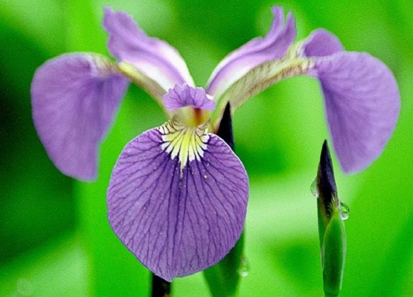

# Programming and Scripting Project - Fisher’s Iris data set

This repository contains the project about Fisher's Iris data set. It includes documentation and code in Python based on researches. 

[See here for the instructions](https://github.com/ianmcloughlin/project-pands/raw/master/project.pdf)

## The main goal and the key points

* Research background information about the data set and write a summary about it.
* Keep a list of references you used in completing the project.
* Download the data set and write some Python code to investigate it.
* Summarise the data set by, for example, calculating the maximum, minimum and mean of each column of the data set. A Python script will quickly do this for you.
* Write a summary of your investigations.
* Include supporting tables and graphics as you deem necessary.

## Background information and summary about the data set

Iris data set is a multivariate data set introduced by the British statistician and biologist Ronald Fisher in his 1936 paper.The use of multiple measurements in taxonomic problems as an example of linear discriminant analysis. It is sometimes called Anderson's Iris data set because Edgar Anderson collected the data to quantify the morphologic variation of Iris flowers of three related species. The data set consists of 50 samples from each of three species of Iris:

||||
|-----------|-----------|-----------|
| Iris Versicolor | Iris Setosa | Iris Virginica |

Four features were measured from each sample:
* Sepal length(cm)
* Sepal Width(cm)
* Petal Length(cm)
* Petal Width(cm)

Based on the combination of the above four features, Fisher developed a linear discriminant model to distinguish the species from each other. 
Interesting and challenging in the relation of Iris flowers is the fact that sepal and petal look quite similar contrary to other flowers where sepal is usually green and easy to distinguish from the petal.

## References

1. [Wikipedia - Iris flower data set](https://en.wikipedia.org/wiki/Iris_flower_data_set)
1. [Iris Versicolor](https://www.lakeforest.edu/academics/programs/environmental/courses/es204/iris_versicolor.php)
1. [Iris Setosa](https://calphotos.berkeley.edu/cgi/img_query?enlarge=0000+0000+1202+1326)
1. [Iris Virginica](https://www.fs.fed.us/wildflowers/beauty/iris/Blue_Flag/images/iris_virginica_virginica_lg.jpg)
1. [Iris Dataset](http://mirlab.org/jang/books/dcpr/dataSetIris.asp?title=2-2%20Iris%20Dataset)
